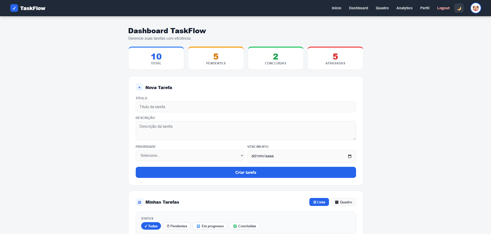
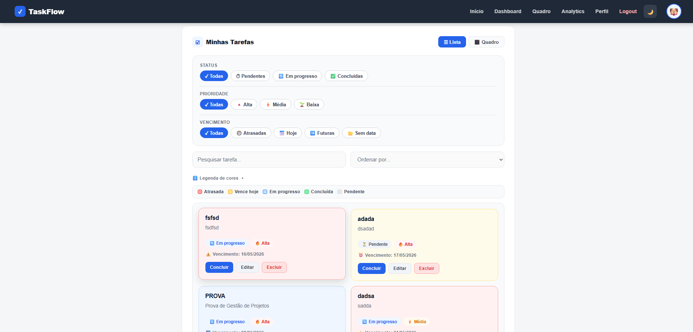
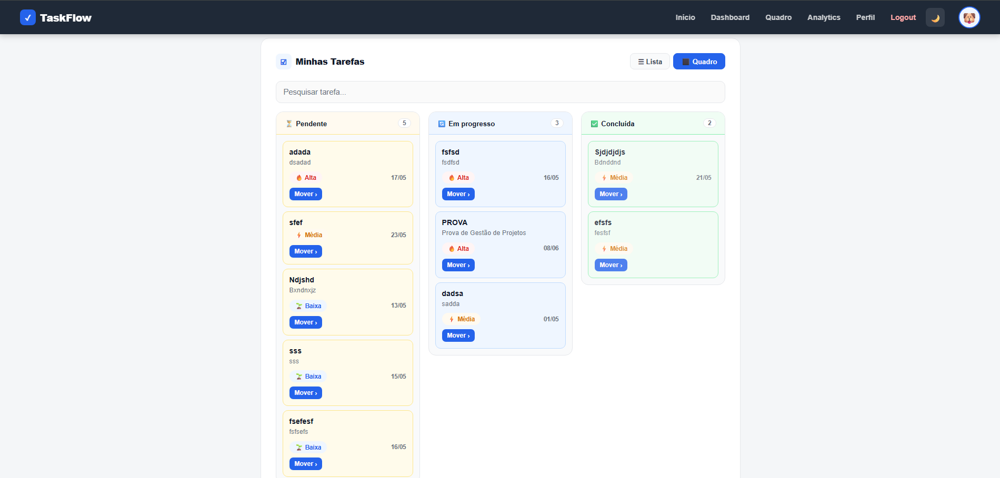
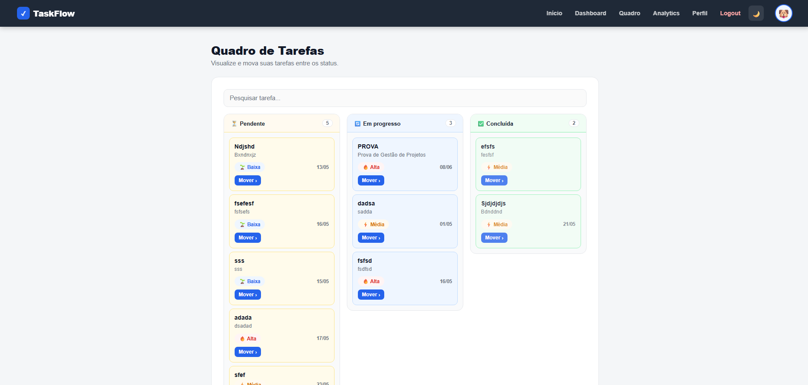
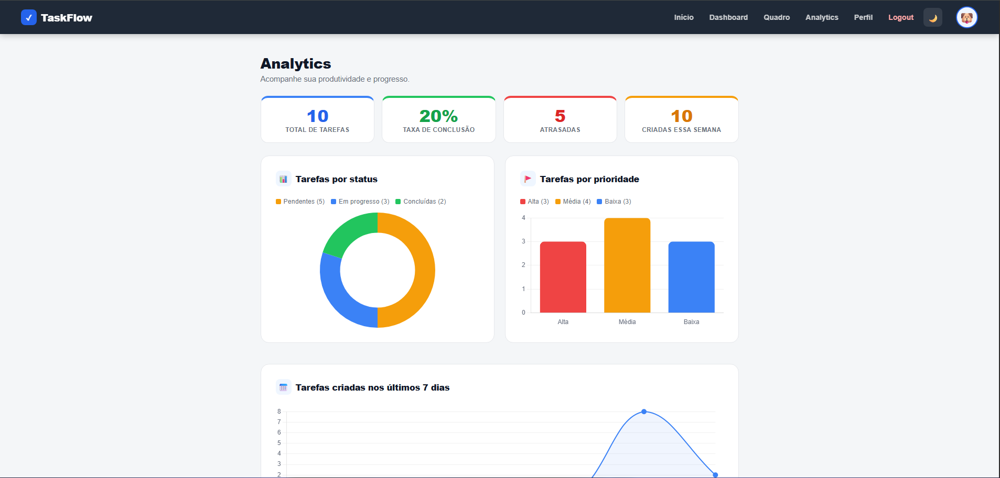
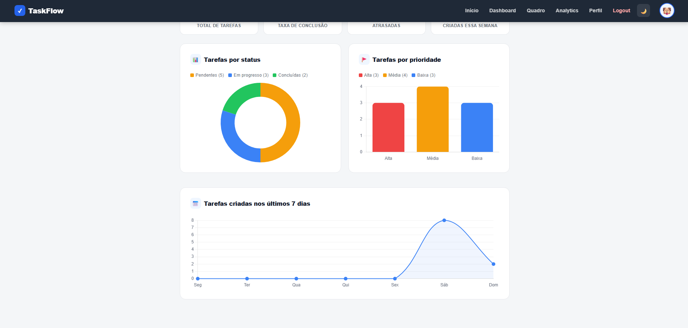
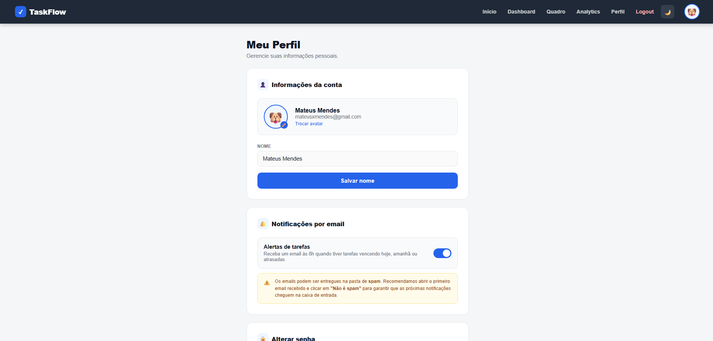
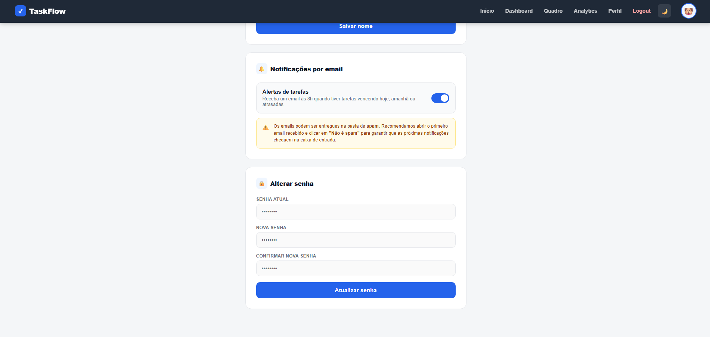
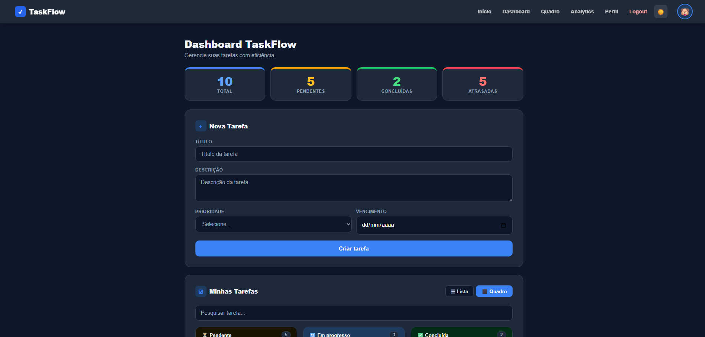
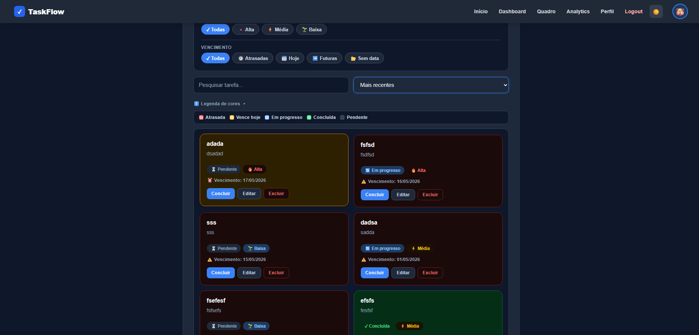

# ✅ TaskFlow

> Aplicação web completa de gerenciamento de tarefas com autenticação, kanban, analytics, dark mode, notificações por email e dashboard responsivo — desenvolvida em Flask.

[](https://taskflow-webapp-production.up.railway.app)
[](https://python.org)
[](https://flask.palletsprojects.com)
[](https://sqlalchemy.org)
[](https://postgresql.org)
[](https://developer.mozilla.org/docs/Web/JavaScript)

---

## 🌐 Demo

**Acesse o projeto online:** [taskflow-webapp-production.up.railway.app](https://taskflow-webapp-production.up.railway.app)

---

## 🎬 Demonstração


---

## 📸 Screenshots

### Página inicial


### Dashboard — Vista Lista


### Dashboard — Vista Quadro


### Quadro de Tarefas (navbar)


### Analytics



### Perfil



### Dark Mode



---

## 🚀 Funcionalidades

### Autenticação
- Cadastro e login de usuários
- Logout seguro
- Proteção de rotas com Flask-Login
- Avatar emoji personalizável no perfil

### Tarefas
- Criar, editar e excluir tarefas
- Campos: título, descrição, prioridade, status e data de vencimento
- Concluir tarefa sem recarregar a página (fetch API)
- Confirmação antes de excluir
- Botão **Mover ›** para alterar status sem arrastar

### Dashboard — Vista Lista
- Cards de estatísticas: Total, Pendentes, Concluídas e Atrasadas
- Indicadores visuais por cor com hierarquia de prioridade:
  - 🔴 Atrasada (sempre prevalece)
  - 🟡 Vence hoje
  - 🔵 Em progresso
  - 🟢 Concluída
- Legenda de cores colapsável
- Filtros dinâmicos por status, prioridade e vencimento (sem reload)
- Pesquisa em tempo real por título e descrição
- Ordenação por: mais importantes, vencimento, prioridade, mais recentes e mais antigas

### Dashboard — Vista Quadro (Kanban)
- Toggle Lista / Quadro
- 3 colunas: Pendente, Em progresso, Concluída
- Drag and drop no desktop (SortableJS)
- Botão Mover ›  no mobile com menu de opções
- Busca em tempo real
- Dica ao hover no desktop

### Página Quadro (navbar)
- Board kanban isolado acessível pela navbar
- Drag and drop no desktop
- Busca com lista unificada no mobile
- Cards coloridos por status

### Analytics
- Gráfico de rosca: tarefas por status
- Gráfico de barras: tarefas por prioridade
- Gráfico de linha: tarefas criadas nos últimos 7 dias
- Cards de métricas: total, taxa de conclusão, atrasadas, criadas essa semana

### Perfil
- Editar nome sem recarregar
- Avatar emoji (🐱 🐶 🦊 🐼 🐸) com picker inline
- Alterar senha
- Toggle de notificações por email

### Notificações por Email
- Envio automático às 8h via SendGrid
- Só envia quando há tarefas vencendo hoje, amanhã ou atrasadas
- Email com seções: Vencem hoje, Vencem amanhã, Atrasadas
- Botão direto para o dashboard
- Ativação/desativação pelo perfil

### UX e Design
- Dark mode com toggle e persistência no localStorage
- Detecção automática do tema do sistema
- Responsividade completa (mobile e desktop)
- Menu hamburguer no mobile
- Toasts para feedback das ações
- Popup de boas-vindas após login
- Favicon personalizado
- Fuso horário correto (America/Sao_Paulo)

---

## 🛠️ Tecnologias

| Camada | Tecnologia |
|--------|-----------|
| Backend | Python, Flask |
| Banco de dados | SQLite (local) / PostgreSQL (produção) |
| ORM | SQLAlchemy, Flask-SQLAlchemy |
| Autenticação | Flask-Login, Flask-Bcrypt |
| Email | SendGrid, APScheduler |
| Frontend | HTML5, CSS3, JavaScript |
| Gráficos | Chart.js |
| Drag and Drop | SortableJS |
| Deploy | Railway |

---

## 📁 Estrutura do projeto

```
taskflow-webapp/
├── app/
│   ├── __init__.py
│   ├── extensions.py
│   ├── models.py
│   ├── routes.py
│   ├── email_service.py
│   ├── scheduler.py
│   ├── static/
│   │   ├── css/style.css
│   │   ├── js/script.js
│   │   └── favicon.svg
│   └── templates/
│       ├── base.html
│       ├── index.html
│       ├── dashboard.html
│       ├── quadro.html
│       ├── analytics.html
│       ├── perfil.html
│       ├── login.html
│       ├── register.html
│       └── edit_task.html
├── docs/
│   ├── Animação.gif
│   ├── dashboard.png
│   ├── dashboard-lista.png
│   ├── quadro-dashboard.png
│   ├── quadro-navbar.png
│   ├── analytics.png
│   ├── analytics2.png
│   ├── perfil.png
│   ├── perfil2.png
│   ├── darkmode.png
│   └── darkmode2.png
├── config.py
├── run.py
├── requirements.txt
└── Procfile
```

---

## ⚙️ Como rodar localmente

### Pré-requisitos
- Python 3.10+
- pip

### Passo a passo

**1. Clone o repositório**
```bash
git clone https://github.com/mateusmendess/taskflow-webapp.git
cd taskflow-webapp
```

**2. Crie e ative o ambiente virtual**
```bash
python -m venv venv

# Windows
venv\Scripts\activate

# Linux/Mac
source venv/bin/activate
```

**3. Instale as dependências**
```bash
pip install -r requirements.txt
```

**4. Configure as variáveis de ambiente**

Crie um arquivo `.env` na raiz do projeto:
```
SECRET_KEY=sua-chave-secreta-aqui
SENDGRID_API_KEY=sua-chave-sendgrid
```

**5. Rode o projeto**
```bash
python run.py
```

**6. Acesse no navegador**
```
http://localhost:5000
```

---

## 👨‍💻 Autor

Feito por **Mateus Mendes**

[](https://github.com/mateusmendess)

---

## 📄 Licença

Este projeto está sob a licença MIT.